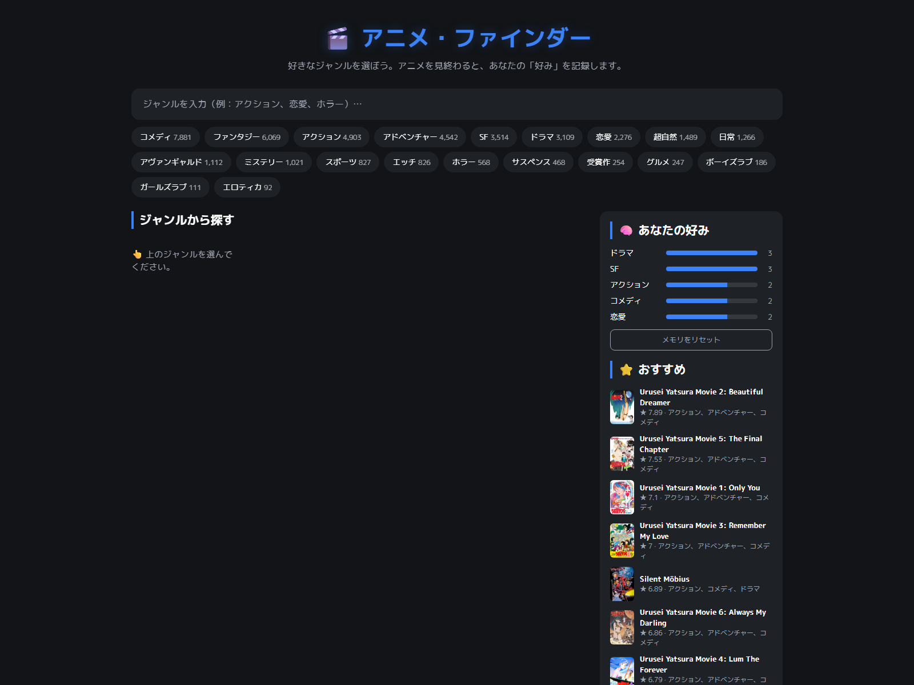
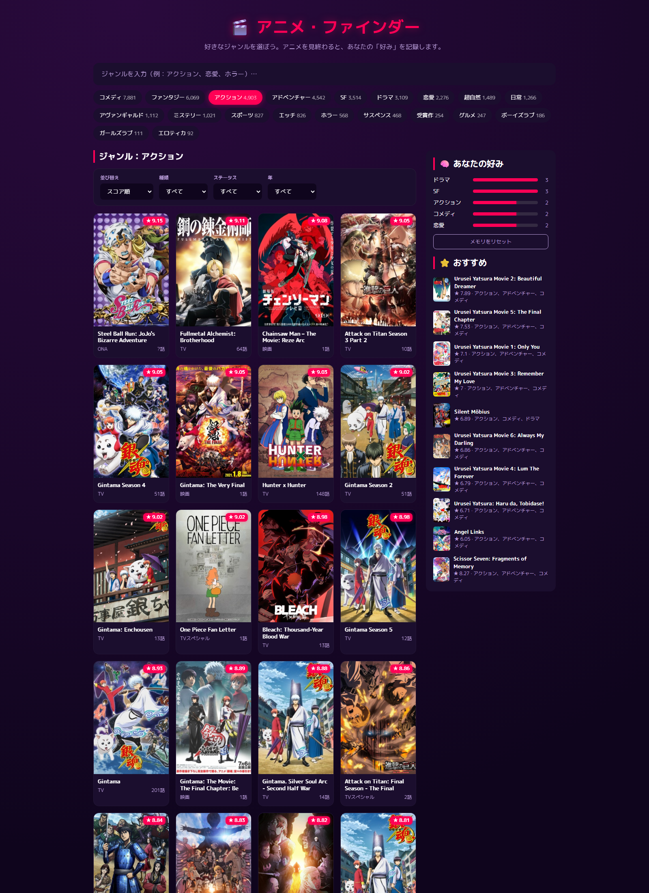
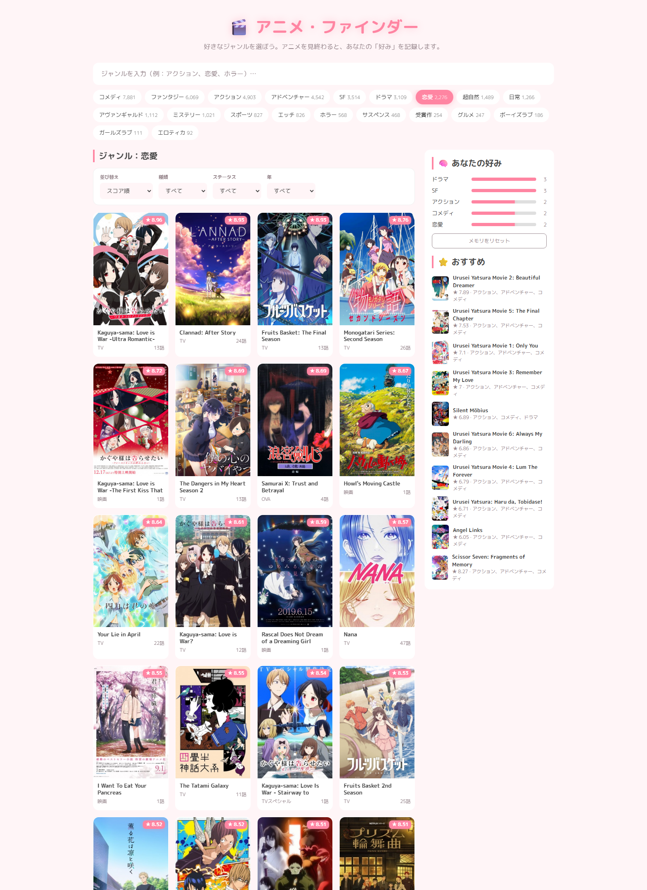
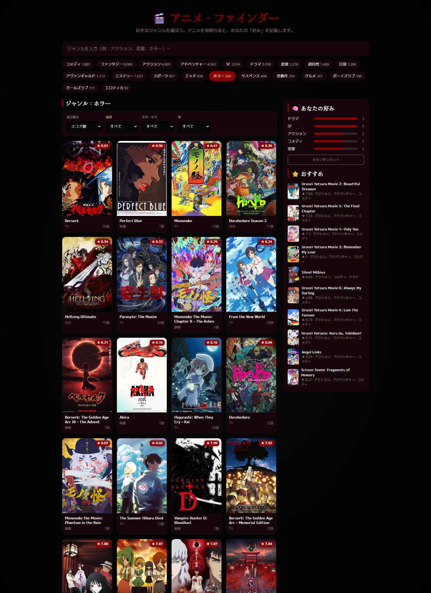
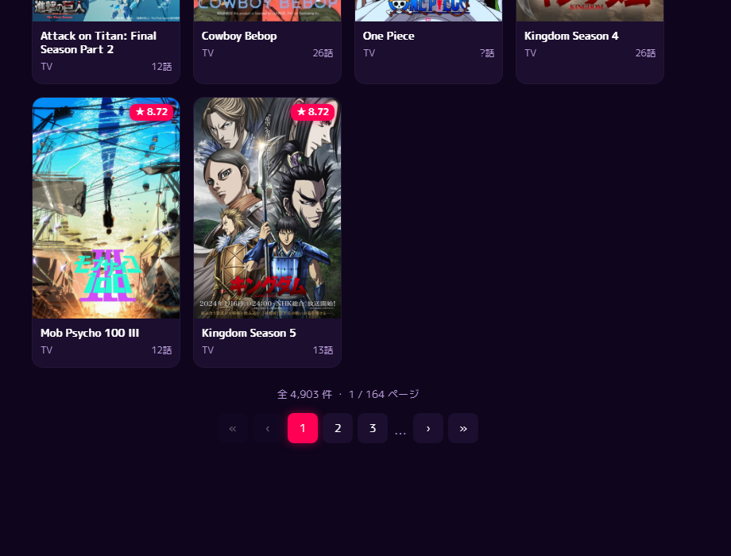

# 🎬 Anime Finder — Genre-based Recommender with Taste Memory

A web app that recommends anime by genre, suggests similar titles, and **learns your taste**:
when you finish watching a series, the app remembers its genres and re-ranks recommendations
toward the genres that overlap most across everything you've finished. The UI is fully in
**Japanese** and dynamically re-themes (colors, fonts, effects) based on the selected genre.

> Built as a portfolio project. Data scraped from MyAnimeList (~28k titles).

## ✨ Features

- **Browse by genre** — pick any of 20 genres; results are paginated across *all* matching titles
  (e.g. Comedy → 7,800+ titles, 260+ pages), not a fixed top-N.
- **Filtering & sorting** — by type (TV/Movie/OVA/…), status (airing/finished/upcoming), year,
  and sort (score / popularity / members / favorites / newest / title).
- **Content-based similarity** — TF-IDF over genres + themes + type, cosine similarity to find
  similar anime for any title.
- **Taste memory (the core idea)** — marking a series as *finished* (watched episodes ≥ total)
  adds its genres to a persistent score. Genres that recur across finished shows rise to the top
  and drive a personalized "For You" ranking.
- **Dynamic theming** — 4 themes that switch by genre group: Neutral (home), Action/Fantasy
  (cyberpunk neon), Romance (soft sakura), Horror (dark mystic + vignette). See [DESIGN.md](DESIGN.md).

## 🖼 Screenshots

| Home (Neutral) | Action | Romance | Horror |
|---|---|---|---|
|  |  |  |  |

Filtering + pagination: 

## 🛠 Tech Stack

- **Backend:** Python, Flask, pandas, scikit-learn (TF-IDF + cosine similarity)
- **Frontend:** vanilla HTML/CSS/JS (CSS variables for theming, Google Fonts: M PLUS 1p,
  M PLUS Rounded 1c, Hina Mincho)
- **Serving:** gunicorn (production), deployed on Render

## 🧩 Architecture

```
src/data_loader.py   # load + clean CSV (parse genres by '|', dedup mal_id, drop Hentai)
src/recommender.py   # TF-IDF + cosine similarity; genre search w/ filter, sort, pagination
src/memory.py        # persistent taste memory (user_memory.json): finished[] + genre_score{}
app.py               # Flask: serves UI + REST API
templates/ static/   # frontend (4 dynamic themes)
```

REST API: `/api/genres`, `/api/anime?genre=&page=&sort=&type=&status=&year=`,
`/api/anime/<id>` (detail + similar), `/api/finish` (POST), `/api/memory`, `/api/recommend`.

## 🚀 Run locally

```bash
python -m venv anime-rec-env
anime-rec-env\Scripts\activate      # Windows PowerShell
pip install -r requirements.txt
python app.py                       # http://127.0.0.1:5000
```

## ☁️ Deploy (Render)

1. Push this repo to GitHub.
2. On [render.com](https://render.com) → **New** → **Web Service** → connect the repo.
3. Render reads [render.yaml](render.yaml) automatically. If configuring manually:
   - **Build command:** `pip install -r requirements.txt`
   - **Start command:** `gunicorn app:app --bind 0.0.0.0:$PORT --workers 1 --timeout 120`
   - **Instance type:** Free
4. Deploy → you get a public `https://<name>.onrender.com` URL.

> Note: on the free tier the service sleeps after inactivity (first request takes ~30–60s to
> wake), and `user_memory.json` resets on each redeploy (ephemeral disk).

## 💡 Future improvements

- Per-user sessions (currently the taste memory is shared/global).
- Collaborative filtering once a `rating.csv` is available (hybrid with the content model).
- Persistent storage (DB) for memory; theme/demographic filters.
